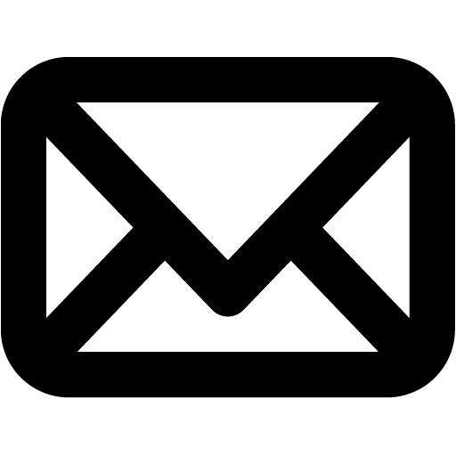

<div align="center">

```aura width=150 height=40 link="https://x.com/collectioneurr"
<div style={{ position: 'relative', display: 'flex', width: '100%', height: '100%', backgroundColor: '#111111', borderRadius: 20, boxSizing: 'border-box' }}>
  <svg width="150" height="40" viewBox="0 0 150 40" overflow="visible" xmlns="http://www.w3.org/2000/svg" style={{ position: 'absolute', top: 0, left: 0, pointerEvents: 'none', overflow: 'visible' }}>
    <defs>
      <linearGradient id="tw-holo-x" gradientUnits="objectBoundingBox" x1="0" y1="0" x2="1" y2="1">
        <stop offset="0%" stopColor="#ffffff" />
        <stop offset="10%" stopColor="#111111" />
        <stop offset="50%" stopColor="#eeeeee" />
        <stop offset="60%" stopColor="#ffbbaa" />
        <stop offset="80%" stopColor="#111111" />
        <stop offset="100%" stopColor="#555555" />
        <animateTransform
          attributeName="gradientTransform"
          type="rotate"
          from="0 0.5 0.5"
          to="360 0.5 0.5"
          dur="8s"
          repeatCount="indefinite"
        />
      </linearGradient>
    </defs>
    <rect x="1.25" y="1.25" width="147.5" height="37.5" rx="18.75" ry="18.75" fill="none" stroke="url(#tw-holo-x)" strokeWidth="2" strokeLinecap="round" strokeLinejoin="round" />
    <rect x="0.25" y="0.25" width="149.5" height="39.5" rx="19.75" ry="19.75" fill="none" stroke="#AAAAAA" strokeWidth="0.5" strokeLinecap="round" strokeLinejoin="round" />
  </svg>
  <div style={{ position: 'relative', display: 'flex', flexDirection: 'row', alignItems: 'center', justifyContent: 'center', gap: '5px', flex: 1, width: '100%', height: '100%', paddingLeft: 12, paddingRight: 10, boxSizing: 'border-box' }}>
  
    <span style={{ fontFamily: 'Inter, sans-serif', fontWeight: 700, fontSize: 13, color: '#f5f5f5', letterSpacing: '-0.2px' }}>@collectioneurr</span>
  </div>
</div>
```

```aura width=150 height=40 link="https://www.linkedin.com/in/ykharchenko/"
<div style={{ position: 'relative', display: 'flex', width: '100%', height: '100%', backgroundColor: '#00121b', borderRadius: 20, boxSizing: 'border-box' }}>
  <svg width="150" height="40" viewBox="0 0 150 40" overflow="visible" xmlns="http://www.w3.org/2000/svg" style={{ position: 'absolute', top: 0, left: 0, pointerEvents: 'none', overflow: 'visible' }}>
    <defs>
      <linearGradient id="tw-holo-li" gradientUnits="objectBoundingBox" x1="0" y1="0" x2="1" y2="1">
        <stop offset="0%" stopColor="#ffffff" />
        <stop offset="10%" stopColor="#001c2b" />
        <stop offset="50%" stopColor="#eeeeee" />
        <stop offset="60%" stopColor="#0077b5" />
        <stop offset="80%" stopColor="#001c2b" />
        <stop offset="100%" stopColor="#555555" />
        <animateTransform
          attributeName="gradientTransform"
          type="rotate"
          from="0 0.5 0.5"
          to="360 0.5 0.5"
          dur="8s"
          repeatCount="indefinite"
        />
      </linearGradient>
    </defs>
    <rect x="1.25" y="1.25" width="147.5" height="37.5" rx="18.75" ry="18.75" fill="none" stroke="url(#tw-holo-li)" strokeWidth="2" strokeLinecap="round" strokeLinejoin="round" />
    <rect x="0.25" y="0.25" width="149.5" height="39.5" rx="19.75" ry="19.75" fill="none" stroke="#AAAAAA" strokeWidth="0.5" strokeLinecap="round" strokeLinejoin="round" />
  </svg>
  <div style={{ position: 'relative', display: 'flex', flexDirection: 'row', alignItems: 'center', justifyContent: 'space-between', flex: 1, width: '100%', height: '100%', paddingLeft: 20, paddingRight: 20, boxSizing: 'border-box' }}>
  
    <span style={{ fontFamily: 'Inter, sans-serif', fontWeight: 700, fontSize: 13, color: '#f5f5f5', letterSpacing: '-0.2px' }}>ykharchenko</span>
  </div>
</div>
```

```aura width=150 height=40 link="mailto:yehorkharchenko4@gmail.com"
<div style={{ position: 'relative', display: 'flex', width: '100%', height: '100%', background: '#ffffff', borderRadius: 20, boxSizing: 'border-box' }}>
  <svg width="150" height="40" viewBox="0 0 150 40" overflow="visible" xmlns="http://www.w3.org/2000/svg" style={{ position: 'absolute', top: 0, left: 0, pointerEvents: 'none', overflow: 'visible' }}>
    <defs>
      <linearGradient id="tw-holo-li" gradientUnits="objectBoundingBox" x1="0" y1="0" x2="1" y2="1">
        <stop offset="0%" stopColor="#001117" />
        <stop offset="10%" stopColor="#ffffff" />
        <stop offset="30%" stopColor="#555555" />
        <stop offset="60%" stopColor="#ffffff" />
        <stop offset="80%" stopColor="#001117" />
        <stop offset="100%" stopColor="#ffffff" />
        <animateTransform
          attributeName="gradientTransform"
          type="rotate"
          from="0 0.5 0.5"
          to="360 0.5 0.5"
          dur="8s"
          repeatCount="indefinite"
        />
      </linearGradient>
    </defs>
    <rect x="1.25" y="1.25" width="147.5" height="37.5" rx="18.75" ry="18.75" fill="none" stroke="url(#tw-holo-li)" strokeWidth="2" strokeLinecap="round" strokeLinejoin="round" />
    <rect x="0.25" y="0.25" width="149.5" height="39.5" rx="19.75" ry="19.75" fill="none" stroke="#000000" strokeWidth="0.5" strokeLinecap="round" strokeLinejoin="round" />
  </svg>
  <div style={{ position: 'relative', display: 'flex', flexDirection: 'row', alignItems: 'center', justifyContent: 'center', gap: "5px", flex: 1, width: '100%', height: '100%', boxSizing: 'border-box' }}>
  
    <span style={{ fontFamily: 'Inter, sans-serif', fontWeight: 700, fontSize: 10, color: '#010101', letterSpacing: '-0.2px' }}>yehorkharchenko4</span>
  </div>
</div>
```

</div>

<br>
<p align="center"><sub>𝗉𝗈𝗐𝖾𝗋𝖾𝖽 𝖻𝗒 <a href="https://github.com/collectioneur/readme-aura">𝗋𝖾𝖺𝖽𝗆𝖾-𝖺𝗎𝗋𝖺</a></sub></p>
